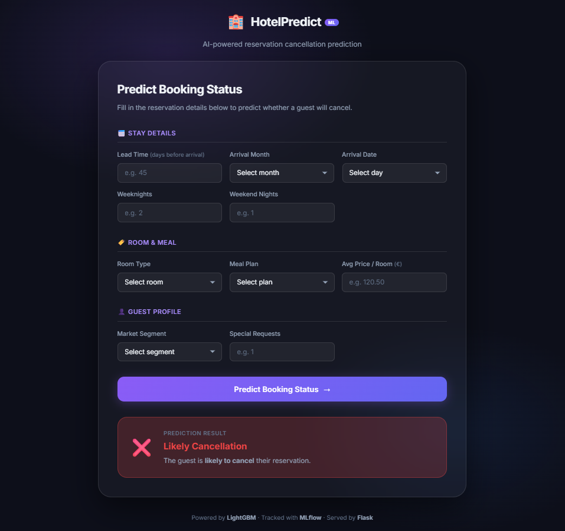

# Hotel Reservations Prediction

Predict hotel reservation cancellations using **LightGBM**, tracked with **MLflow**, served via **Flask**, and deployed on **Google Cloud Run** through **Jenkins CI/CD**.

---

```
Raw CSV (GCS)  →  Training Pipeline  →  LightGBM Model (.pkl)
                                              ↓
                              Flask App  →  Prediction API
                                              ↓
                         Jenkins CI/CD  →  Google Cloud Run
```

---

## Documentation

| Tài liệu | Mô tả |
|----------|-------|
| [Installation](docs/installation.md) | Install environment, dependencies, credentials |
| [Quick Start](docs/quickstart.md) | Quick start guide for local testing |
| [Training Guide](docs/training.md) | Machine learning pipeline, configuration, MLflow tracking |
| [Architecture](docs/architecture.md) | Project structure, design, data flow |
| [Deployment Guide](docs/deployment.md) | Full deployment guide: GCP + Jenkins + Cloud Run |

---

## Dataset

The dataset is sourced from Kaggle: [Hotel Reservations Dataset](https://www.kaggle.com/datasets/ahsan81/hotel-reservations-classification-dataset). 

This dataset contains historical hotel reservation data, including features such as booking details, customer information, and whether the reservation was canceled.

## Tech Stack

| Layer | Technology |
|-------|-----------|
| ML Model | LightGBM + scikit-learn |
| Experiment Tracking | MLflow |
| Serving | Flask + Gunicorn |
| Containerisation | Docker (multi-stage, Python 3.11) |
| CI/CD | Jenkins |
| Cloud | GCP Cloud Run + GCS |
| Data Balancing | SMOTE (imbalanced-learn) |


## Demo



---

## License

MIT — see [LICENSE](LICENSE).
